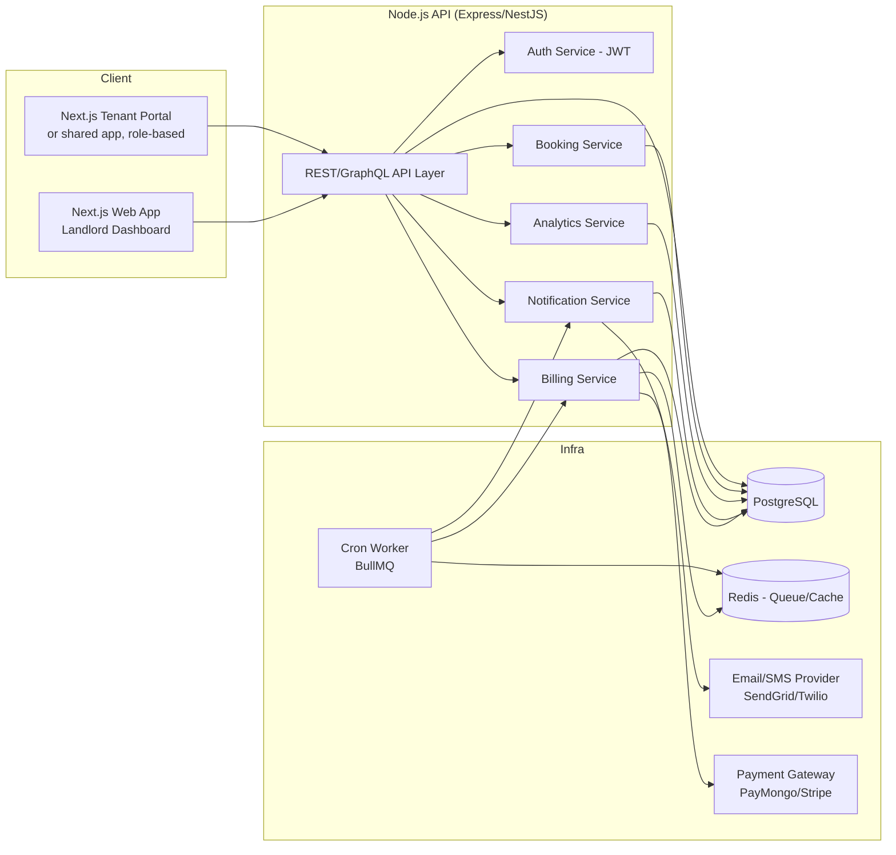
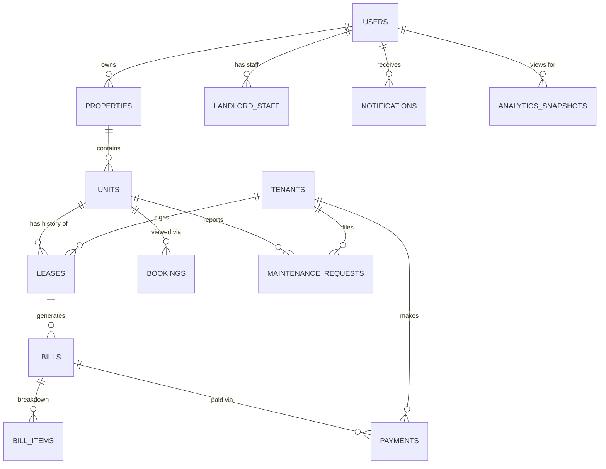
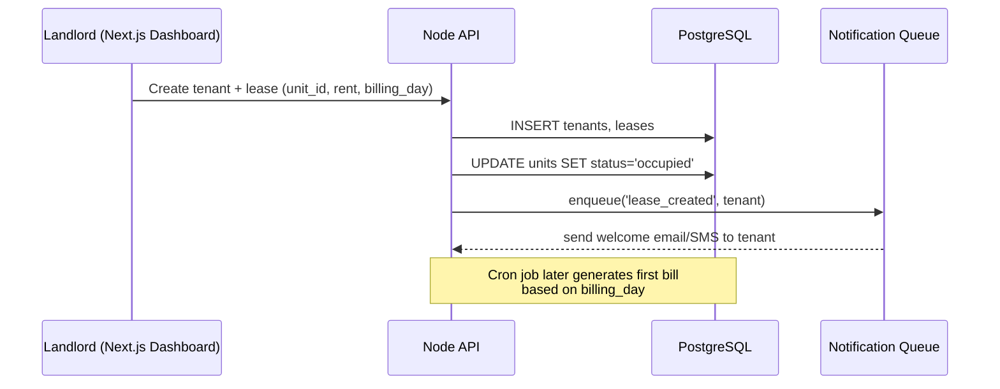
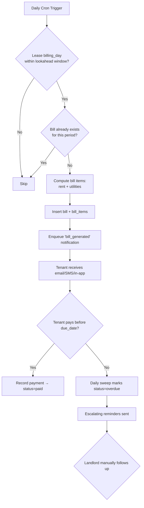
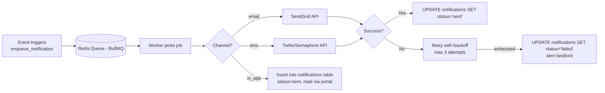

# Landlord/Boarding House Management Platform — Implementation Plan

**Stack:** Next.js (frontend, App Router) · Node.js/Express (or NestJS) backend API · PostgreSQL · Redis (queues/cache) · Deployed as separate frontend/backend services

---

## 1. Product Scope

| Module | Description |
|---|---|
| Property & Unit Management | Landlord manages properties, units/rooms, rent rates, amenities |
| Tenant Management | Tenant profiles, leases, move-in/move-out |
| Billing | Monthly rent + utility billing, auto-generation, payment tracking |
| Notifications | Due-date reminders, overdue alerts, payment confirmations (email/SMS/in-app) |
| Bookings (optional) | Prospective tenant unit viewing requests |
| Maintenance Requests | Tenant-submitted issues, status tracking |
| Analytics/Dashboard | Occupancy rate, revenue, collection rate, outstanding balances |
| Auth & Roles | Landlord (owner/admin), Staff, Tenant portal login |

**User roles:**
- **Landlord/Owner** — full access to their properties
- **Staff** — scoped access (e.g. collector, maintenance)
- **Tenant** — portal to view bills, pay, submit maintenance requests, receive notifications

---

## 2. High-Level Architecture



**Notes:**
- A single Next.js app can serve both landlord and tenant portals behind role-based routing (`/dashboard/*` vs `/portal/*`), or split into two apps if you want fully separate deploys. Given your prior FoldGo pattern (staff app vs customer app), splitting by audience is a reasonable option if you want independent release cycles — but for a web-only product, one Next.js app with route groups is simpler to maintain.
- Cron/queue worker (BullMQ + Redis) handles: monthly bill generation, overdue sweeps, notification dispatch — same pattern as the cron-based billing sweep you used in FoldGo's PayMongo integration.
- Payment gateway is optional at MVP (bills can be marked paid manually by landlord); integrate PayMongo later using the same DIY Payment Intents approach you already have experience with.

---

## 3. Database Schema (PostgreSQL)

```sql
-- =========================================================
-- USERS & AUTH
-- =========================================================
CREATE TYPE user_role AS ENUM ('landlord', 'staff', 'tenant');

CREATE TABLE users (
    id              UUID PRIMARY KEY DEFAULT gen_random_uuid(),
    email           VARCHAR(255) UNIQUE NOT NULL,
    password_hash   VARCHAR(255) NOT NULL,
    full_name       VARCHAR(150) NOT NULL,
    phone           VARCHAR(30),
    role            user_role NOT NULL DEFAULT 'tenant',
    is_active       BOOLEAN NOT NULL DEFAULT TRUE,
    email_verified  BOOLEAN NOT NULL DEFAULT FALSE,
    created_at      TIMESTAMPTZ NOT NULL DEFAULT now(),
    updated_at      TIMESTAMPTZ NOT NULL DEFAULT now()
);

-- Staff-to-landlord relationship (a staff member works under a landlord/org)
CREATE TABLE landlord_staff (
    id              UUID PRIMARY KEY DEFAULT gen_random_uuid(),
    landlord_id     UUID NOT NULL REFERENCES users(id) ON DELETE CASCADE,
    staff_user_id   UUID NOT NULL REFERENCES users(id) ON DELETE CASCADE,
    permissions     JSONB NOT NULL DEFAULT '{}', -- e.g. {"billing": true, "maintenance": true}
    created_at      TIMESTAMPTZ NOT NULL DEFAULT now(),
    UNIQUE (landlord_id, staff_user_id)
);

-- =========================================================
-- PROPERTIES & UNITS
-- =========================================================
CREATE TABLE properties (
    id              UUID PRIMARY KEY DEFAULT gen_random_uuid(),
    landlord_id     UUID NOT NULL REFERENCES users(id) ON DELETE CASCADE,
    name            VARCHAR(150) NOT NULL,
    address_line    VARCHAR(255) NOT NULL,
    city            VARCHAR(100) NOT NULL,
    province        VARCHAR(100),
    postal_code     VARCHAR(20),
    latitude        NUMERIC(10,7),
    longitude       NUMERIC(10,7),
    property_type   VARCHAR(50) NOT NULL DEFAULT 'apartment', -- apartment/boarding_house/condo
    amenities       JSONB NOT NULL DEFAULT '[]',
    cover_photo_url TEXT,
    created_at      TIMESTAMPTZ NOT NULL DEFAULT now(),
    updated_at      TIMESTAMPTZ NOT NULL DEFAULT now()
);

CREATE TYPE unit_status AS ENUM ('vacant', 'occupied', 'maintenance', 'reserved');

CREATE TABLE units (
    id              UUID PRIMARY KEY DEFAULT gen_random_uuid(),
    property_id     UUID NOT NULL REFERENCES properties(id) ON DELETE CASCADE,
    unit_number     VARCHAR(50) NOT NULL,
    floor           VARCHAR(20),
    unit_type       VARCHAR(50), -- studio/1BR/shared room etc.
    monthly_rent    NUMERIC(12,2) NOT NULL,
    max_occupants   SMALLINT NOT NULL DEFAULT 1,
    status          unit_status NOT NULL DEFAULT 'vacant',
    amenities       JSONB NOT NULL DEFAULT '[]',
    photos          JSONB NOT NULL DEFAULT '[]',
    created_at      TIMESTAMPTZ NOT NULL DEFAULT now(),
    updated_at      TIMESTAMPTZ NOT NULL DEFAULT now(),
    UNIQUE (property_id, unit_number)
);

CREATE INDEX idx_units_property_status ON units(property_id, status);

-- =========================================================
-- TENANTS & LEASES
-- =========================================================
CREATE TABLE tenants (
    id                  UUID PRIMARY KEY DEFAULT gen_random_uuid(),
    user_id             UUID REFERENCES users(id) ON DELETE SET NULL, -- nullable: tenant may not have portal login yet
    full_name           VARCHAR(150) NOT NULL,
    email               VARCHAR(255),
    phone               VARCHAR(30) NOT NULL,
    id_number           VARCHAR(100),
    emergency_contact   JSONB, -- {name, phone, relationship}
    created_at          TIMESTAMPTZ NOT NULL DEFAULT now(),
    updated_at          TIMESTAMPTZ NOT NULL DEFAULT now()
);

CREATE TYPE lease_status AS ENUM ('active', 'ended', 'terminated', 'pending');

CREATE TABLE leases (
    id                  UUID PRIMARY KEY DEFAULT gen_random_uuid(),
    tenant_id           UUID NOT NULL REFERENCES tenants(id) ON DELETE CASCADE,
    unit_id             UUID NOT NULL REFERENCES units(id) ON DELETE RESTRICT,
    start_date          DATE NOT NULL,
    end_date            DATE, -- null = open-ended
    monthly_rent        NUMERIC(12,2) NOT NULL,
    deposit_amount      NUMERIC(12,2) NOT NULL DEFAULT 0,
    billing_day         SMALLINT NOT NULL DEFAULT 1, -- day of month rent is due (1-28)
    status              lease_status NOT NULL DEFAULT 'active',
    utility_config      JSONB NOT NULL DEFAULT '{}', -- e.g. {"water": "fixed:200", "electric": "metered"}
    created_at          TIMESTAMPTZ NOT NULL DEFAULT now(),
    updated_at          TIMESTAMPTZ NOT NULL DEFAULT now()
);

CREATE INDEX idx_leases_tenant ON leases(tenant_id);
CREATE INDEX idx_leases_unit_status ON leases(unit_id, status);

-- Only one active lease per unit at a time — enforced at application layer
-- (or via partial unique index if desired):
CREATE UNIQUE INDEX uniq_active_lease_per_unit
    ON leases(unit_id) WHERE status = 'active';

-- =========================================================
-- BILLING
-- =========================================================
CREATE TYPE bill_status AS ENUM ('pending', 'partial', 'paid', 'overdue', 'void');

CREATE TABLE bills (
    id              UUID PRIMARY KEY DEFAULT gen_random_uuid(),
    lease_id        UUID NOT NULL REFERENCES leases(id) ON DELETE CASCADE,
    tenant_id       UUID NOT NULL REFERENCES tenants(id) ON DELETE CASCADE,
    billing_period  DATE NOT NULL, -- normalized to 1st of month, e.g. 2026-08-01
    due_date        DATE NOT NULL,
    subtotal        NUMERIC(12,2) NOT NULL DEFAULT 0,
    total_amount    NUMERIC(12,2) NOT NULL DEFAULT 0,
    amount_paid     NUMERIC(12,2) NOT NULL DEFAULT 0,
    status          bill_status NOT NULL DEFAULT 'pending',
    generated_at    TIMESTAMPTZ NOT NULL DEFAULT now(),
    updated_at      TIMESTAMPTZ NOT NULL DEFAULT now(),
    UNIQUE (lease_id, billing_period)
);

CREATE INDEX idx_bills_status_due ON bills(status, due_date);
CREATE INDEX idx_bills_tenant ON bills(tenant_id);

CREATE TABLE bill_items (
    id          UUID PRIMARY KEY DEFAULT gen_random_uuid(),
    bill_id     UUID NOT NULL REFERENCES bills(id) ON DELETE CASCADE,
    item_type   VARCHAR(50) NOT NULL, -- rent/water/electricity/internet/parking/penalty/other
    description VARCHAR(255),
    quantity    NUMERIC(10,2) DEFAULT 1,
    unit_price  NUMERIC(12,2) NOT NULL,
    amount      NUMERIC(12,2) NOT NULL
);

CREATE TABLE payments (
    id              UUID PRIMARY KEY DEFAULT gen_random_uuid(),
    bill_id         UUID NOT NULL REFERENCES bills(id) ON DELETE CASCADE,
    tenant_id       UUID NOT NULL REFERENCES tenants(id) ON DELETE CASCADE,
    amount          NUMERIC(12,2) NOT NULL,
    payment_method  VARCHAR(50) NOT NULL, -- cash/gcash/bank_transfer/card/paymongo
    reference_no    VARCHAR(150),
    paid_at         TIMESTAMPTZ NOT NULL DEFAULT now(),
    recorded_by     UUID REFERENCES users(id), -- landlord/staff who recorded it (null if via gateway webhook)
    created_at      TIMESTAMPTZ NOT NULL DEFAULT now()
);

CREATE INDEX idx_payments_bill ON payments(bill_id);
CREATE INDEX idx_payments_tenant ON payments(tenant_id);

-- =========================================================
-- NOTIFICATIONS
-- =========================================================
CREATE TYPE notification_channel AS ENUM ('email', 'sms', 'push', 'in_app');
CREATE TYPE notification_status AS ENUM ('pending', 'sent', 'failed');

CREATE TABLE notification_templates (
    id          UUID PRIMARY KEY DEFAULT gen_random_uuid(),
    type        VARCHAR(50) UNIQUE NOT NULL, -- bill_due_reminder/bill_overdue/payment_received/booking_confirmed
    subject     VARCHAR(255),
    body        TEXT NOT NULL -- supports {{tenant_name}}, {{amount}}, {{due_date}} placeholders
);

CREATE TABLE notifications (
    id                  UUID PRIMARY KEY DEFAULT gen_random_uuid(),
    recipient_user_id   UUID REFERENCES users(id) ON DELETE CASCADE,
    type                VARCHAR(50) NOT NULL,
    channel             notification_channel NOT NULL,
    title               VARCHAR(255),
    message             TEXT NOT NULL,
    related_entity_type VARCHAR(50), -- bill/lease/booking/maintenance_request
    related_entity_id   UUID,
    status              notification_status NOT NULL DEFAULT 'pending',
    sent_at             TIMESTAMPTZ,
    created_at          TIMESTAMPTZ NOT NULL DEFAULT now()
);

CREATE INDEX idx_notifications_recipient ON notifications(recipient_user_id, status);

-- =========================================================
-- BOOKINGS (optional module)
-- =========================================================
CREATE TYPE booking_status AS ENUM ('requested', 'confirmed', 'cancelled', 'completed');

CREATE TABLE bookings (
    id              UUID PRIMARY KEY DEFAULT gen_random_uuid(),
    unit_id         UUID NOT NULL REFERENCES units(id) ON DELETE CASCADE,
    prospect_name   VARCHAR(150) NOT NULL,
    prospect_email  VARCHAR(255),
    prospect_phone  VARCHAR(30) NOT NULL,
    requested_at    TIMESTAMPTZ NOT NULL,
    status          booking_status NOT NULL DEFAULT 'requested',
    notes           TEXT,
    created_at      TIMESTAMPTZ NOT NULL DEFAULT now()
);

CREATE INDEX idx_bookings_unit_status ON bookings(unit_id, status);

-- =========================================================
-- MAINTENANCE REQUESTS
-- =========================================================
CREATE TYPE maintenance_status AS ENUM ('open', 'in_progress', 'resolved', 'cancelled');
CREATE TYPE maintenance_priority AS ENUM ('low', 'medium', 'high', 'urgent');

CREATE TABLE maintenance_requests (
    id              UUID PRIMARY KEY DEFAULT gen_random_uuid(),
    unit_id         UUID NOT NULL REFERENCES units(id) ON DELETE CASCADE,
    tenant_id       UUID REFERENCES tenants(id) ON DELETE SET NULL,
    category        VARCHAR(50) NOT NULL, -- plumbing/electrical/appliance/other
    description     TEXT NOT NULL,
    priority        maintenance_priority NOT NULL DEFAULT 'medium',
    status          maintenance_status NOT NULL DEFAULT 'open',
    photos          JSONB NOT NULL DEFAULT '[]',
    created_at      TIMESTAMPTZ NOT NULL DEFAULT now(),
    resolved_at     TIMESTAMPTZ
);

-- =========================================================
-- ANALYTICS (materialized snapshots for fast dashboard reads)
-- =========================================================
CREATE TABLE analytics_snapshots (
    id                  UUID PRIMARY KEY DEFAULT gen_random_uuid(),
    landlord_id         UUID NOT NULL REFERENCES users(id) ON DELETE CASCADE,
    property_id         UUID REFERENCES properties(id) ON DELETE CASCADE, -- null = all properties
    period              DATE NOT NULL, -- month, normalized to 1st
    total_units         INTEGER NOT NULL DEFAULT 0,
    occupied_units      INTEGER NOT NULL DEFAULT 0,
    occupancy_rate      NUMERIC(5,2) NOT NULL DEFAULT 0,
    total_billed        NUMERIC(14,2) NOT NULL DEFAULT 0,
    total_collected     NUMERIC(14,2) NOT NULL DEFAULT 0,
    total_outstanding   NUMERIC(14,2) NOT NULL DEFAULT 0,
    collection_rate     NUMERIC(5,2) NOT NULL DEFAULT 0,
    generated_at        TIMESTAMPTZ NOT NULL DEFAULT now(),
    UNIQUE (landlord_id, property_id, period)
);

-- =========================================================
-- AUDIT LOG
-- =========================================================
CREATE TABLE audit_logs (
    id          UUID PRIMARY KEY DEFAULT gen_random_uuid(),
    actor_id    UUID REFERENCES users(id),
    action      VARCHAR(100) NOT NULL, -- e.g. bill.paid, lease.terminated
    entity_type VARCHAR(50) NOT NULL,
    entity_id   UUID NOT NULL,
    metadata    JSONB DEFAULT '{}',
    created_at  TIMESTAMPTZ NOT NULL DEFAULT now()
);
```

### Entity Relationship Summary



---

## 4. Core Algorithms

### 4.1 Monthly Bill Auto-Generation (Cron Job)

Runs daily; generates bills a configurable number of days **before** each lease's billing day (e.g. 5 days ahead), so tenants get advance notice.

```
FUNCTION generateBillsForToday():
    today = current_date
    lookahead_days = 5
    target_day = today.day + lookahead_days

    active_leases = SELECT * FROM leases
                     WHERE status = 'active'
                       AND billing_day = target_day (mod month length)

    FOR EACH lease IN active_leases:
        period = normalize_to_month_start(today + lookahead_days)

        IF bill already exists for (lease.id, period):
            CONTINUE  -- idempotent, avoid duplicates

        due_date = date(period.year, period.month, lease.billing_day)

        items = []
        items.append({type: 'rent', amount: lease.monthly_rent})

        FOR EACH (utility, config) IN lease.utility_config:
            IF config.mode == 'fixed':
                items.append({type: utility, amount: config.amount})
            ELSE IF config.mode == 'metered':
                # requires prior meter reading input by landlord/staff
                reading = getLatestMeterReading(lease.unit_id, utility, period)
                items.append({type: utility, amount: reading.computed_amount})

        subtotal = sum(items.amount)

        bill = INSERT INTO bills (lease_id, tenant_id, billing_period,
                                   due_date, subtotal, total_amount, status)
               VALUES (lease.id, lease.tenant_id, period,
                       due_date, subtotal, subtotal, 'pending')

        INSERT INTO bill_items (bill_id, ...) for each item

        enqueue_notification(type='bill_generated', bill.id)
```

### 4.2 Overdue Detection & Escalating Reminders

Runs daily.

```
FUNCTION sweepOverdueBills():
    today = current_date

    # Reminder before due date
    upcoming = SELECT * FROM bills
               WHERE status = 'pending'
                 AND due_date - today IN (3, 1)  -- days before due
    FOR EACH bill IN upcoming:
        enqueue_notification('bill_due_reminder', bill)

    # Mark overdue
    newly_overdue = SELECT * FROM bills
                     WHERE status IN ('pending','partial')
                       AND due_date < today
    FOR EACH bill IN newly_overdue:
        UPDATE bills SET status = 'overdue' WHERE id = bill.id
        enqueue_notification('bill_overdue', bill)

    # Escalation for long overdue (e.g. > 7 days)
    escalations = SELECT * FROM bills
                   WHERE status = 'overdue'
                     AND today - due_date IN (7, 14, 30)
    FOR EACH bill IN escalations:
        enqueue_notification('bill_overdue_escalation', bill, urgency=HIGH)
        notify_landlord(bill)
```

### 4.3 Payment Application (handles partial payments)

```
FUNCTION recordPayment(bill_id, amount, method, reference, recorded_by):
    bill = SELECT * FROM bills WHERE id = bill_id FOR UPDATE  -- row lock

    INSERT INTO payments (bill_id, tenant_id, amount, payment_method,
                           reference_no, recorded_by)
           VALUES (bill_id, bill.tenant_id, amount, method, reference, recorded_by)

    new_paid = bill.amount_paid + amount

    IF new_paid >= bill.total_amount:
        new_status = 'paid'
    ELSE IF new_paid > 0:
        new_status = 'partial'
    ELSE:
        new_status = bill.status

    UPDATE bills SET amount_paid = new_paid, status = new_status
           WHERE id = bill_id

    INSERT INTO audit_logs (action='bill.payment_recorded', ...)

    IF new_status == 'paid':
        enqueue_notification('payment_received', bill)
```

### 4.4 Analytics Snapshot Aggregation

Runs monthly (and on-demand for live dashboard reads via cached query + snapshot fallback).

```
FUNCTION generateAnalyticsSnapshot(landlord_id, period):
    properties = SELECT * FROM properties WHERE landlord_id = landlord_id

    FOR EACH property IN properties:
        total_units = COUNT(units WHERE property_id = property.id)
        occupied_units = COUNT(units WHERE property_id = property.id AND status='occupied')
        occupancy_rate = occupied_units / total_units * 100

        total_billed = SUM(bills.total_amount
                            WHERE lease.unit.property_id = property.id
                              AND billing_period = period)
        total_collected = SUM(bills.amount_paid WHERE ... same filter)
        total_outstanding = total_billed - total_collected
        collection_rate = total_collected / total_billed * 100 (guard divide-by-zero)

        UPSERT INTO analytics_snapshots (...)

    # Landlord-level rollup (property_id = NULL) = sum across all properties
    UPSERT INTO analytics_snapshots (landlord_id, property_id=NULL, period, ...)
```

### 4.5 Booking Confirmation Flow (optional module)

```
FUNCTION requestBooking(unit_id, prospect_info, requested_at):
    IF unit.status != 'vacant':
        REJECT "Unit not available"

    booking = INSERT INTO bookings (..., status='requested')
    notify_landlord('new_booking_request', booking)
    RETURN booking

FUNCTION confirmBooking(booking_id, landlord_id):
    booking = SELECT * FROM bookings WHERE id = booking_id
    UPDATE bookings SET status = 'confirmed'
    UPDATE units SET status = 'reserved' WHERE id = booking.unit_id
    notify_prospect('booking_confirmed', booking)
```

---

## 5. Key Flows (Diagrams)

### 5.1 Tenant Onboarding → First Bill



### 5.2 Monthly Billing Cycle



### 5.3 Notification Dispatch (Queue Worker)



---

## 6. API Surface (REST, high level)

```
Auth
  POST   /auth/register
  POST   /auth/login
  POST   /auth/refresh

Properties & Units
  GET    /properties
  POST   /properties
  GET    /properties/:id/units
  POST   /properties/:id/units
  PATCH  /units/:id

Tenants & Leases
  GET    /tenants
  POST   /tenants
  POST   /leases
  PATCH  /leases/:id/terminate

Billing
  GET    /bills?status=&tenant_id=&period=
  POST   /bills/:id/payments
  GET    /bills/:id
  POST   /bills/generate  (manual trigger, admin only)

Notifications
  GET    /notifications
  PATCH  /notifications/:id/read

Bookings
  POST   /public/units/:id/book        (no auth — public request form)
  GET    /bookings
  PATCH  /bookings/:id/confirm

Maintenance
  POST   /maintenance-requests
  GET    /maintenance-requests
  PATCH  /maintenance-requests/:id

Analytics
  GET    /analytics/dashboard?property_id=&period=
  GET    /analytics/revenue-trend
```

---

## 7. Suggested Tech Choices (aligned to your stack)

- **Backend:** Node.js + Express (or NestJS if you want structured DI/module architecture closer to what you're used to from Clean Architecture on Android).
- **ORM:** Prisma — schema maps cleanly to the SQL above and gives you type-safe queries in TS.
- **Auth:** JWT access + refresh tokens, `bcrypt` for password hashing, role-based middleware (landlord/staff/tenant).
- **Queue/Cron:** BullMQ + Redis for bill generation, overdue sweeps, and notification dispatch — same pattern as your FoldGo billing sweep.
- **Notifications:** SendGrid (email) + Twilio or Semaphore (SMS, cheaper for PH numbers) + in-app table for portal.
- **Payments (optional/phase 2):** PayMongo, reusing your DIY Payment Intents + webhook signature verification approach from FoldGo.
- **Frontend:** Next.js App Router, React Server Components for dashboard reads, client components for forms; Tailwind + shadcn/ui for admin UI; React Query or SWR for client-side data fetching/mutations.
- **File storage:** S3-compatible bucket (e.g. Supabase Storage or Cloudflare R2) for unit photos, tenant IDs, maintenance photos.

---

## 8. Implementation Roadmap

**Phase 1 — Foundation (Week 1-2)**
- Auth (landlord/staff/tenant roles), properties, units CRUD
- Database schema + Prisma migrations

**Phase 2 — Tenant & Lease Management (Week 2-3)**
- Tenant CRUD, lease creation/termination
- Unit status sync with lease lifecycle

**Phase 3 — Billing Core (Week 3-5)**
- Bill generation cron, bill items, manual payment recording
- Overdue sweep + status transitions

**Phase 4 — Notifications (Week 5-6)**
- BullMQ worker, email/SMS integration, in-app notification center
- Templates for due reminder, overdue, payment received

**Phase 5 — Dashboard & Analytics (Week 6-7)**
- Analytics snapshot job, dashboard UI (occupancy, revenue, collection rate)
- Revenue trend charts

**Phase 6 — Optional Modules (Week 7-9)**
- Bookings (public unit listing + request form)
- Maintenance requests (tenant portal)
- PayMongo online payment integration

**Phase 7 — Polish & Launch (Week 9-10)**
- Role-based access hardening, audit logs, PDF invoice export, deploy

---

## 9. Open Decisions to Confirm

1. Single Next.js app with route-group role separation, or two separate apps (landlord dashboard vs tenant portal)?
2. Utility billing: fixed rate per unit, or metered readings entered manually by staff?
3. Online payments at MVP, or manual payment recording first (defer PayMongo to Phase 6)?
4. Multi-property support per landlord from day one, or single-property MVP?
